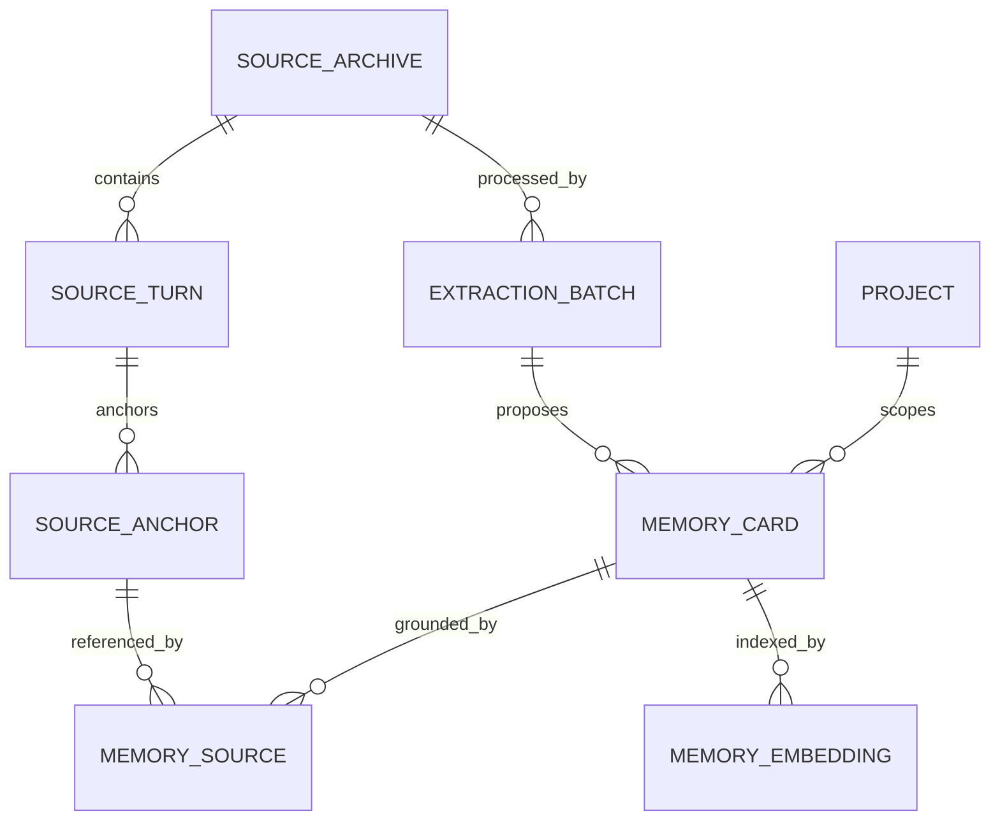

# Data Model

## Entities



## Source Archive

```ts
export interface SourceArchive {
  id: string;
  provider: "chatgpt" | "gemini" | "claude" | "generic" | "unknown";
  providerConversationId?: string;
  title?: string;
  url?: string;
  captureMethod: "official_export" | "main_world_network" | "devtools_network" | "dom" | "clipboard";
  capturedAt: string;
  contentHash: string;
  schemaVersion: number;
  warnings: CaptureWarning[];
}
```

Manual memories use `provider: "generic"` with `captureMethod: "clipboard"` and a `contextvault://manual/...` URL. Official or external imports preserve the normalized provider (`chatgpt`, `gemini`, `claude`, or `generic`) and express the ingestion path through `captureMethod`, not through extra provider enum values.

Manual memory archives are deduplicated by a canonical hash of the normalized pasted body, because the archive represents source text rather than a particular memory-card title. If the user submits an exact accepted manual card again, the existing card is returned instead of creating duplicate archive or card records. If the same pasted source is intentionally shaped into a different title, card type, scope, tag set, owner, or due date, the existing source archive and turn are reused while a new source-grounded card is created. Legacy manual archives whose hash included both title and body are still reused by matching their stored source turn text.

Date-time fields are stored as canonical UTC strings in the same shape produced by `Date.prototype.toISOString()`, for example `2026-06-08T00:00:00.000Z`. Imports should reject date-only strings, natural-language dates, timezone-offset forms, and impossible dates before they enter the vault.

## Source Turn

```ts
export interface SourceTurn {
  id: string;
  archiveId: string;
  providerTurnId?: string;
  role: "user" | "assistant" | "system" | "tool" | "unknown";
  text: string;
  createdAt?: string;
  orderIndex: number;
  contentHash: string;
}
```

Source turn text is capped at 500,000 characters, and a single source archive or normalized conversation capture is capped at 1,000 turns. Turn IDs, archive IDs, provider turn IDs, and content hashes are capped at 512 characters; DOM/source selectors are capped at 1,000 characters. These limits keep official exports and external JSON imports from exhausting the side panel, validation, search, or IndexedDB pipeline while still allowing long real-world conversations to be archived.

Saving an archive by id has replacement semantics for its source turns: old turns for that archive id are removed in the same IndexedDB transaction before the new archive and turn set are written. This avoids stale turns lingering after retries, repairs, or future recapture flows that reuse an archive id.

Full vault export reads archives, source turns, and memory cards in one IndexedDB readonly transaction before assembling the JSON backup, so the backup reflects a single local snapshot rather than a series of separate store reads.

Vault import writes archives, source turns, and memory cards in one IndexedDB readwrite transaction using no-overwrite inserts. If any archive, source turn, or memory-card primary key already exists, the transaction aborts and no partial import is committed. The service layer still performs user-friendly conflict preflight, but the storage layer also enforces this invariant as the final safety net.

The browser storage layer also exposes a readonly vault integrity audit. It reads source archives, source turns, and memory cards in one transaction, then reports malformed source-archive fields, malformed source-turn fields, malformed memory-card scalar fields, malformed source-anchor required and optional fields, orphan source turns, empty archives, cards without anchors, anchors that point to missing archives or turns, anchors whose turn belongs to a different archive, invalid anchor spans, quote/span mismatches, and quotes that no longer exist in the referenced source turn. The audit is intentionally non-mutating: it returns counts plus a capped issue-detail list so a damaged vault can be inspected without deleting or rewriting user data.

## Source Anchor

```ts
export interface SourceAnchor {
  id: string;
  archiveId: string;
  turnId: string;
  charStart?: number;
  charEnd?: number;
  quote?: string;
}
```

## Extraction Batch

```ts
export interface ExtractionBatch {
  id: string;
  archiveId: string;
  extractor: string;
  model?: string;
  promptVersion: string;
  createdAt: string;
  status: "pending" | "running" | "completed" | "failed";
  error?: string;
}
```

## Memory Card

```ts
export interface MemoryCard {
  id: string;
  batchId?: string;
  projectId?: string;
  type: "project_fact" | "decision" | "todo" | "preference" | "method" | "citation_anchor";
  title: string;
  body: string;
  status: "proposed" | "accepted" | "rejected" | "archived" | "superseded";
  scope: "global" | "project" | "conversation";
  sensitivity: "normal" | "sensitive" | "secret";
  confidence?: number;
  tags: string[];
  createdAt: string;
  updatedAt: string;
  acceptedAt?: string; // accepted cards only
  dueAt?: string; // todo cards only
  owner?: string; // todo cards only
  sourceAnchors: SourceAnchor[];
}
```

Memory card titles are capped at 160 characters and memory card bodies are capped at 20,000 characters across review, manual creation, JSON import, and runtime update paths. Memory card IDs, batch IDs, and project IDs are capped at 512 characters. Todo owners are capped at 200 characters. A card may carry at most 50 tags, each at most 80 characters after canonicalization, and at most 50 source anchors. Source-anchor IDs, archive IDs, and turn IDs are capped at 512 characters, while optional source-anchor quotes are capped at the same 20,000-character bound as memory bodies. Runtime updates also reject unsupported type/status/scope/sensitivity values, malformed timestamps, out-of-range confidence values, incomplete char spans, reversed spans, and empty anchor quotes before loading source archives for grounding checks. Raw source turns may be much larger than memory cards, but they still have a defensive per-turn cap because archive evidence should not become an unbounded storage or search payload. Memory cards should stay distilled and reusable.

Tags are stored in canonical form without leading `#` markers and without surrounding whitespace. Tag duplicate checks are case-insensitive after canonicalization, while the first entered casing is preserved for display and export. Runtime edits and manual memory creation enforce the same tag count and tag length bounds before storage.

## Decision Metadata

```ts
export interface DecisionMetadata {
  memoryCardId: string;
  decision: string;
  rationale?: string;
  alternatives?: string[];
  consequences?: string[];
}
```

## Todo Metadata

```ts
export interface TodoMetadata {
  memoryCardId: string;
  status: "open" | "in_progress" | "done" | "cancelled";
  dueAt?: string;
  owner?: string;
  projectId?: string;
}
```

## Memory Source

```ts
export interface MemorySource {
  memoryCardId: string;
  sourceAnchorId: string;
  relevance: "primary" | "supporting";
}
```

## Memory Embedding

```ts
export interface MemoryEmbedding {
  memoryCardId: string;
  provider: string;
  model: string;
  dimensions: number;
  vector: number[];
  createdAt: string;
}
```

## Project

```ts
export interface Project {
  id: string;
  name: string;
  description?: string;
  tags: string[];
  createdAt: string;
  updatedAt: string;
}
```

## Storage Notes

### Browser MVP

Use IndexedDB stores:

- `source_archives`
- `source_turns`
- `source_anchors`
- `extraction_batches`
- `memory_cards`
- `memory_sources`
- `projects`
- `settings`

Current MVP indexes:

- `source_archives.capturedAt`
- `source_archives.provider`
- `source_archives.contentHash` for exact repeat capture and manual-source deduplication
- `source_turns.archiveId`
- `memory_cards.status`
- `memory_cards.type`
- `memory_cards.createdAt`

Use a schema migration layer from the beginning. The current browser schema is versioned and upgrades older vaults by adding the `contentHash` index when needed.

The side panel should surface browser storage estimates when available, using `navigator.storage.estimate()` locally to warn before large official imports or raw archives push the vault near quota. Import flows should check estimated free space before reading large files and use conservative headroom because IndexedDB objects and indexes add storage overhead beyond the uploaded file size.

Archive deletion cascades through source turns and source anchors. Memory cards that would have no remaining source anchors after the archive is deleted are removed with the archive; multi-source cards are preserved with only the deleted archive's anchors removed.

Archive deletion, prompt copy, and Markdown export tolerate malformed local memory-card anchors by operating only on anchors whose required `id`, `archiveId`, and `turnId` fields are valid strings. Fully malformed cards are left in place for the readonly Vault Health audit to report instead of blocking unrelated archive operations.

Vault Health also checks source-anchor optional fields before evidence matching: `charStart` and `charEnd` must be non-negative integers when present, both span endpoints must be provided together, and `quote` must be a non-empty bounded string when present. Malformed optional fields are reported as shape issues instead of being allowed to cascade into misleading quote or span mismatch reports.

Vault Health checks source archives and turns before source-anchor evidence matching. Archive IDs, providers, capture methods, timestamps, content hashes, schema versions, URLs/titles, and capture warnings are diagnosed directly; turn IDs, archive IDs, roles, text, timestamps, order indexes, content hashes, and source selectors are also checked. If a referenced turn has malformed archive linkage or text, the audit reports the malformed turn and avoids adding misleading anchor mismatch or missing-quote diagnostics that depend on valid source text.

Read-only memory-card surfaces such as search, preview, disclosure warnings, prompt copy, Markdown export, and delete confirmations use safe fallback values for malformed scalar fields loaded from local storage. Vault Health reports those malformed fields explicitly. This is a UI resilience measure only: import, runtime update, and source-grounding validation still reject malformed cards before writing them.

Vault integrity audit reports are capped at 100 issue details while preserving the full issue count. This keeps future side-panel health checks responsive even if a damaged local store contains many repeated orphan turns or broken anchors.

### Desktop Or Local App Path

Use SQLite:

- relational tables for source and memory entities
- FTS5 virtual table for text search
- vector extension or sidecar vector database for embeddings

## JSON Schema

Starter schemas are available at:

- `../schemas/memory-card.schema.json`
- `../schemas/vault-export.schema.json`

The vault export schema covers the JSON shape, required fields, enums, scalar constraints, and metadata bounds. It also records defensive import scale limits: at most 2,000 archives, 20,000 memory cards, 1,000 turns per archive, 500,000 characters per source turn, 50 tags per card, 50 source anchors per card, and 100 capture warnings per archive. Runtime validation still owns semantic checks such as total source-turn count across the backup, source-anchor reference resolution, duplicate IDs across nested collections, character-span bounds, canonical tag duplicate detection, and quote matching.
