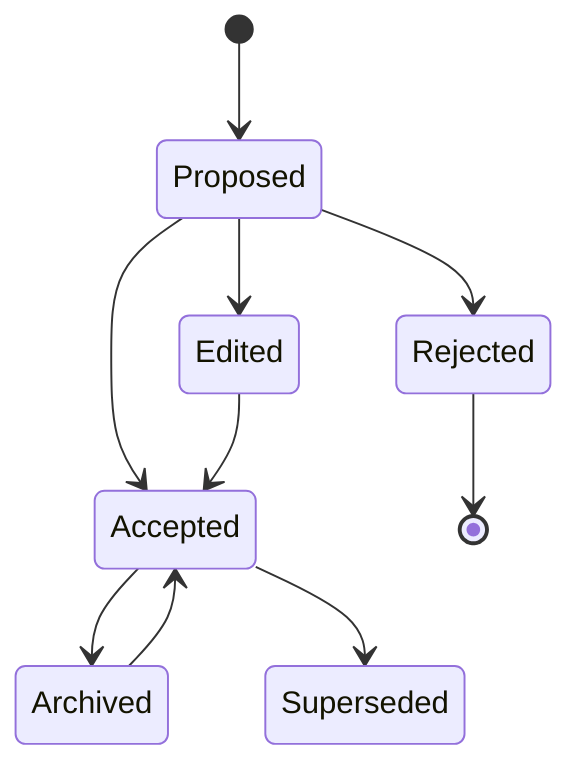

# Memory Model

## Goal

ContextVault should not become another undifferentiated chat archive. The memory model separates raw source from reviewed, reusable cards.

## Two Store Pattern

### Raw Conversation Archive

Immutable, source-grounded archive of captured conversations.

Properties:

- Preserves original turns.
- Records capture method.
- Includes source anchors.
- Tracks content hash.
- Can be deleted by user.
- Can be reprocessed into new memory cards.

### Memory Cards

Small, reviewed, reusable pieces of knowledge extracted from raw conversations.

Properties:

- User-confirmed before becoming permanent.
- Editable.
- Searchable.
- Typed.
- Linked to source turns.
- Can be scoped to project, topic, or global preference.

## Memory Card Types

### Project Fact

Stable information about a project.

Example:

```json
{
  "type": "project_fact",
  "title": "ContextVault is local-first",
  "body": "The MVP should keep user data on the local machine by default.",
  "scope": "project"
}
```

### Decision Record

A decision plus rationale and alternatives.

Example:

```json
{
  "type": "decision",
  "title": "Use Side Panel for review workflow",
  "body": "The side panel gives users enough space to capture, review, search, and return memory without leaving the AI conversation.",
  "decision": "Use chrome.sidePanel for MVP UI.",
  "rationale": "Popup UI is too transient for card review and source inspection.",
  "alternatives": ["extension popup", "separate web app"]
}
```

### Todo

An actionable item.

Example:

```json
{
  "type": "todo",
  "title": "Implement ChatGPT adapter",
  "body": "Create the first ChatGPT adapter with MAIN world network capture and DOM fallback.",
  "status": "open",
  "owner": "user",
  "dueAt": "2026-06-09T00:00:00.000Z"
}
```

During review and manual memory creation, todo cards should expose owner and due date controls. The browser MVP stores due dates as ISO date strings while using a simple date input in the side panel. Owner and due date are todo-only metadata; changing a card from `todo` to another type should clear those fields before the draft is saved, and runtime requests should reject owner or due date metadata on non-todo manual cards. Memory card bodies are capped at 20,000 characters across review, manual creation, JSON import, and runtime update paths because permanent memory should remain reusable distilled context, not bulk raw chat import. Todo owners are capped at 200 characters.

### Preference

A durable user preference.

Example:

```json
{
  "type": "preference",
  "title": "Prefer reviewed permanent memory",
  "body": "Automatic extraction may propose memory cards, but permanent memory should require explicit user confirmation.",
  "scope": "global"
}
```

### Method

A reusable workflow, prompt, checklist, or template.

Example:

```json
{
  "type": "method",
  "title": "Conversation-to-memory workflow",
  "body": "Capture raw conversation, extract cards, review with source anchors, confirm, index, and recall in future sessions."
}
```

### Citation Anchor

A memory whose value is primarily source traceability.

Example:

```json
{
  "type": "citation_anchor",
  "title": "Source for MV3 capture constraint",
  "body": "The project should not use DNR as a response body extraction mechanism.",
  "sourceAnchors": ["archive_20260607_turn_3"]
}
```

## Card Lifecycle



## Review Rules

Permanent memory should require one user action:

- Accept.
- Accept after edit.
- Accept all from a trusted extraction batch.

The system may auto-label low-risk draft cards, but should not silently promote them to permanent memory in MVP.
Tag input accepts comma, semicolon, fullwidth comma/semicolon, and newline separators. Stored tags are trimmed, stripped of leading `#`, deduplicated case-insensitively, capped at 50 tags per card, and capped at 80 characters per tag.
`acceptedAt` is accepted-state metadata. Accepted cards should carry it, using the card's `updatedAt` as a deterministic fallback when repairing older imports; non-accepted cards should not keep stale `acceptedAt` values.

## Source Anchors

Every memory card must link to one or more source anchors.

Anchor fields:

- archive id
- turn id
- role
- integer character span when available
- provider URL
- capture timestamp

JSON import validation must reject source archives or turns with empty IDs, oversized IDs, empty turn text, oversized turn text, too many turns in one archive, oversized titles/URLs/selectors/content hashes, invalid timestamps, unsupported schema versions, non-integer or duplicate per-archive order indexes, duplicate source turn IDs, empty content hashes, or too many capture warnings. It must also reject memory cards with empty titles/bodies, oversized metadata, too many tags, oversized tags, duplicate tags, too many source anchors, invalid optional field types, fractional spans, or source anchors that do not resolve to an archive and turn in the same vault export. Source turns must belong to their containing archive. If an anchor provides a character span or quote, the span must stay inside the turn text and the quote must match that turn; source-anchor quotes are capped at 20,000 characters. Runtime memory-card edits should preserve the same source-grounding invariant before storage, and update operations should not create new cards for unknown IDs. Validation errors should include field paths such as `$.memoryCards[0].sourceAnchors[0].turnId`.

## Quality Criteria

A good memory card is:

- concise
- reusable
- source-linked
- not merely a summary of the whole conversation
- clear about scope
- safe to reuse without misleading context

## Extraction Prompt Contract

The extraction engine should output structured JSON, not freeform prose.

Required fields:

- `type`
- `title`
- `body`
- `confidence`
- `scope`
- `sourceAnchors`
- `sensitivity`
- `suggestedTags`

The extractor must skip:

- greetings
- one-off phrasing with no future value
- unsupported claims without source turn
- secrets unless explicitly marked as sensitive draft
- generic long text without project, decision, todo, workflow, preference, or other reusable-memory signals
