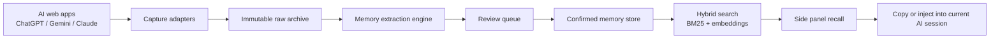
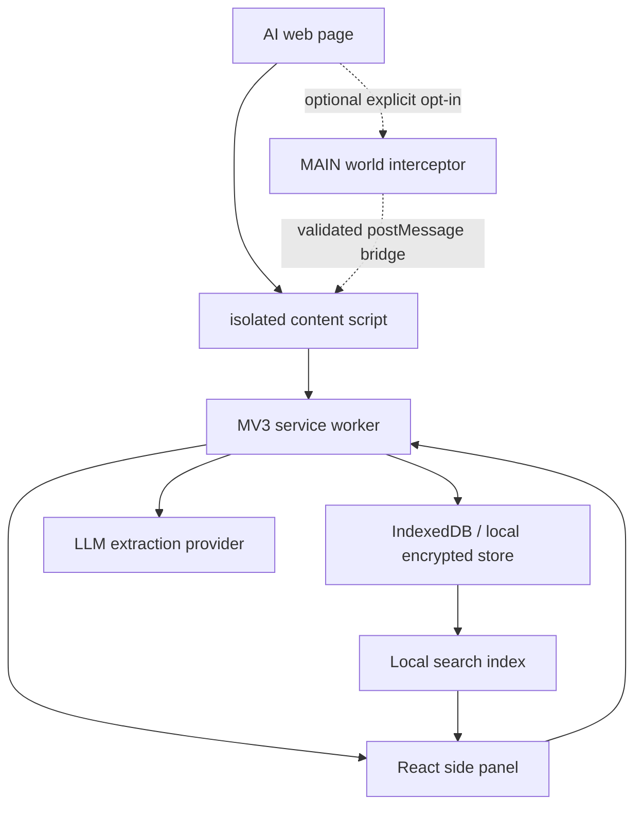

# Technical Architecture

## System Overview

ContextVault has three layers:

1. Conversation capture layer.
2. Memory distillation layer.
3. Retrieval and return layer.

## Extension Architecture

## Main Components

### Chrome MV3 Extension

Responsibilities:

- Load site-specific capture adapters.
- Provide `chrome.sidePanel` UI.
- Coordinate capture jobs.
- Store raw conversation archives and memory cards.
- Run local keyword search.
- Call configured LLM/embedding providers when enabled.

### Capture Adapters

Adapters encapsulate site-specific logic:

- `chatgpt`
- `gemini`
- `claude` later
- `generic-dom` fallback
- `official-import` for exported archives

Each adapter should return a normalized `ConversationCapture` object.

### Immutable Raw Archive

Stores the original captured content as close to source as practical:

- provider
- conversation id
- capture method
- captured turns
- raw request/response fragments when available
- DOM snapshot fallback when needed
- timestamps
- content hash

Archives should not be silently modified after creation. If the exact same snapshot is captured again, reuse the existing archive by `contentHash`; if the conversation content has changed, create a new archive revision.

### Memory Extraction Engine

Takes a raw archive and proposes cards:

- project facts
- decision records
- todos
- preferences
- methods/templates
- citation anchors

The engine must produce source spans for every card.

### Review Queue

Cards are not permanent until the user confirms them.

Supported actions:

- accept
- reject
- edit
- merge
- split
- tag
- assign project
- mark sensitivity

### Memory Store

Stores accepted memory cards and indexes them for retrieval.

### Retrieval Layer

Combines:

- BM25 / FTS keyword search.
- Embedding search.
- Filters by provider, project, tag, time, memory type, sensitivity, and status.
- Reranking for top results.

### Return Layer

Returns memories to current work:

- copy selected memories as Markdown.
- inject into text box where technically and safely possible.
- export to Markdown / Obsidian / Notion / Yuque.
- later: prompt pack templates.

## Data Flow

1. User clicks capture in side panel.
2. Side panel asks service worker to start capture for the active tab.
3. Service worker identifies provider and loads matching adapter.
4. Adapter attempts capture by priority order.
5. Captured raw conversation is normalized.
6. Archive content hash is checked for exact duplicates.
7. New snapshots are saved with source anchors; exact duplicate snapshots reuse the existing archive and cards.
8. Extraction job proposes memory cards.
9. User reviews proposed cards.
10. Accepted cards are indexed.
11. Search/recall retrieves cards for future sessions.

## Runtime Boundaries

| Runtime | What Runs There | Notes |
| --- | --- | --- |
| Page MAIN world | fetch/XHR patch | Closest to page JS, highest security caution. |
| Isolated content script | bridge and DOM fallback | Safer extension context, cannot directly patch page globals. |
| Service worker | coordination, storage, provider calls | MV3 worker can be suspended; persist job state. |
| Side panel | user interface | Long-lived UI surface for review/search. |
| Optional desktop helper | SQLite, local models, file sync | Future path if browser storage becomes limiting. |

## Extension Permissions

Start narrow:

- `sidePanel`
- `storage`
- `activeTab`
- host permissions for supported AI domains

The MVP does not request the broader `tabs` permission. The service worker may still query the active tab and message the content script; URL/title access is covered by the explicit supported-provider host permissions and the user-triggered active tab context.

The manifest should also keep injection and page-exposed assets narrow:

- one content-script bundle, `content/content-script.js`, scoped to the supported AI domains
- `run_at: document_start`, so the isolated bridge is ready before the optional MAIN world interceptor posts messages
- one web-accessible resource, `main-world/interceptor.js`, scoped to the same supported AI domains
- no `<all_urls>`, `https://*/*`, or `http://*/*` match patterns

Avoid broad permissions until needed. If a future capture adapter requires a new domain or permission, add it as an explicit manifest entry with tests and documentation rather than widening the existing patterns.

## Failure Modes

| Failure | Response |
| --- | --- |
| Network stream capture fails | Fall back to DOM extraction. |
| DOM changes break adapter | Show adapter health warning and allow manual copy/import. |
| LLM extraction fails | Store archive and keep extraction retryable. |
| User rejects all cards | Preserve raw archive only if user opted in. |
| Service worker suspends | Persist capture job checkpoints. |
| Provider website blocks injection | Offer copy-to-clipboard return path. |
